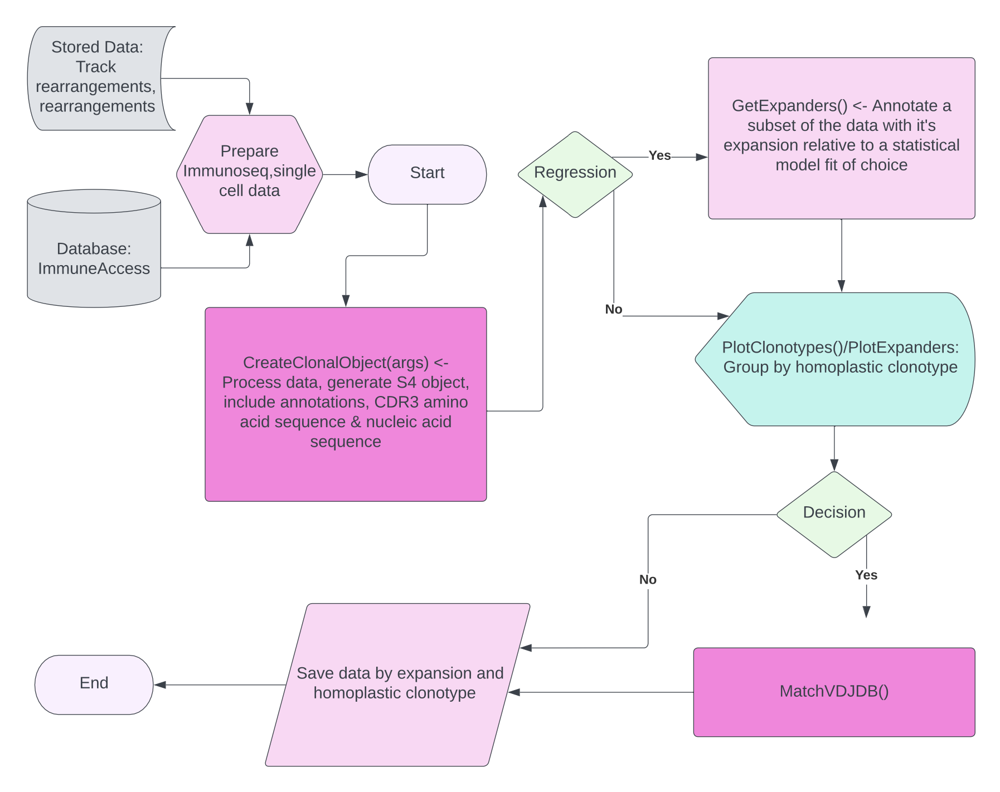

# VRTrack
**VRTrack** is a software package written in R and Rcpp for the prediction of antigen specific T cells from the masses.

The tool is compatible with Adaptive biotechnologies' T cell receptors (TCR) immunoseq assay (https://www.immunoseq.com), or any time series CDR3 TCRbeta dataset of a TCR repertoire in the format of nucleic acid sequence productive frequency, the corresponding amino acid sequences and the total number of T cells at each time point. The data can be from multiple conditions or treatments and multiple time points.

# Biological motivation
The TCR sequence is important to study because the specificity of a T cell depends on a variable region of the TCR, known as the **CDR3**. T cells can be grouped into clonotypes that share a common CDR3 beta sequence and this way, used to approximate the potential frequency of target specific T cells in the blood. Harnessing the heterogenous sequence between T cells for a quantitative analysis of T cell immunology has broad applicability to *in vivo* data analysis because an immune response to a pathogen depends on availability of immune cells (including T cells) with capacity to mount a response against infection. 

**Variable region Track** (**VRTrack**) is a software package of statistical tools that can be used to analyse, annotate and query antigen specific clonotypes that may amplify or decrease in frequency following antigen stimulation or between experimental conditions. **VRTrack** has initially been applied to Virus specific T cells (VSTs) that contain a variable number of target specific cells, caused by a mix of bystander and potent VST clonotypes. However, the tool can be adapted to model other barcoded time series frequency data. 

Steps to run the software are illustrated below in the flow chart and functions are documented in detail in the manual. Sequence and time series data are imported along with total T cell numbers at each time point. **VRTrack** is different to alternative TCR frequencing tracking methods, for example frequency doubling metrics or the probability that two observations of a clonotype frequency fall outside the 95% confidence interval of a binomial distribution. **VRTrack** differs from these existing appraoches because instead of defining a threshold difference in frequency to mark individual cells within clonotypes as expanders, **VRTrack** is Bayesian, in the sense that the frequency of all clonotypes at all time points is included in a statistical model to fit the average expansion of all clonotypes within a product over time. It is common for clonotypes to fall below the limit of detection in time series immunosequencing experiments model and the tool is designed to model this by including drop out events.

Results of VRTrack provide additional to extrapolate the CDR3 sequences of T cell clonotypes with the greatest expansion, annotates these clonotypes with sequence metadata so that the frequency of clonotypes that share the same amino acid sequence (homoplastic frequency) can be jointly merged with expansion, queried in online databases and included as additional metadata in a single cell RNA sequencing (scRNAseq) experiment.

</img>

Flow chart showing VRTrack usage.

# Data inputs: 
Total numbers $(n)$ of T cells for each condition and time point must be included as a vector. The numbers should be listed in sequential order of time points and the ordering of the conditions should not change between time points, for example for $j$ conditions $n_{1}-n_{j}$ over $k$ time points $n_{1}(1)-n_{j}(k)$, the input vector should be in the form $$N=(n_{1}(1),n_{2}(1),...,n_{j}(1),...,n_{1}(k),n_{2}(k),...,n_{j}(k)).$$ If importing an Adaptive TCR immunoseq assay, the input files are the track rearrangements files for both the nucleic acid and amino acid sequences and the rearrangements file. For alternative data, matrices must be included in a specific format. Two matrices are required for input, one with the CDR3 sequence in amino acids and another with the CDR3 sequence in nucleic acids. Rows of the matrix must correspond to unique TCRBeta CDR3s and columns of the matrix should correspond to the TCR repertoire for each sample so that elements of the matrix are the productive frequency of each rearrangement for each sample.

Columns should be organised in the same way as the cell number input, i.e. by treatment or donor first for the initial time point, so that for $q$ unique CDR3 sequences,$j$ conditions and $k$ time points, the input matrix $M$ has $q$ rows and $j\mbox{k}$ columns

$$M=\begin{bmatrix}a_{11}(1) & a_{12}(1) & ... & a_{1j}(1) & ... & a_{11}(k) & a_{12}(k) & ... & a_{1j}(k) \\\ a_{21}(1) & a_{22}(1) & ... & a_{2j}(1) & ... & a_{21}(k) & a_{22}(k) & ... & a_{2j}(k) \\\ \vdots & . & & . & & . & .& & . \\\ . & . & & . & \ddots & . & .& & . \\\ . & . & & . & & . &. & & .  \\\a_{q1}(1) & a_{q2}(1) & ... & a_{qj}(1) & ... & a_{q1}(k) & a_{q2}(k) & ... & a_{qj}(k) \end{bmatrix}$$

# Installation: 

install_github("MaeWoods/VRTrack");

library("VRTrack")

# Documentation: 
VRTrack can be used following the flow chart above, to read in the data and create a clonal object with CDR3 annotations and time series productive frequency, run the function CreateClonalObject().

cp paste the function definitions

To model clonotype expansion, a suite of statistical models are provided to 
