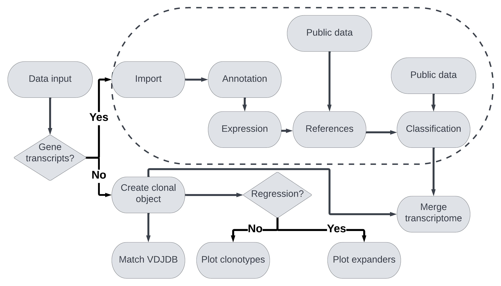

# aocseq 0.1.0: An R package for mixed cell type annotation following the activation of cells & sequencing.

**aocseq** is a suite of statistical tools for the analysis of multimodal immunosequencing data. 

The purpose of this statistical tool is to quantify single cell data and provide **1)** A sample list of mixed cell types with accompanying data sheets to collate detectable clonotypes that are present in the blood or tissue and **2)** To detect, score and rank cells with optimal or desirable characteristics. Characteristics are defined by the gene expression of cells that are considered of interest because of their response to perturbation. 

# Research applications

The software goals are to combine probability and control theory with existing single cell analysis software for the classification of cells. Ultimately the aim is to provide a flexible framework that can be used to analyze a broad range of functional experiments that produce multi-modal data consisting of multiple different cell types. For a list of applications, see the section **Getting started** for the vignettes or the [documentation](https://github.com/MaeWoods/aocseq/raw/main/aocseq.pdf) listing the functions. 

# Rationale for initial package development

The sofware was initially developed to identify receptor sequences from single cell RNA sequencing coupled with amplification of the receptor sequence. Version 0.1.0 can be used with single cell sequencing data of cells that have been activated through the binding of their T cell receptors (TCRs) to cognate antigens. The tool provides a method to identify full length TCRs with specificity directed toward a target antigen. The long term aim of the package is to develop functionality for the analysis of a broad range of sequencing techniques applicable to polyclonal cells.

**Introduction to TCR sequencing**

T cells are part of the immune system and these cells recognize targets on their cell surface or other cell surfaces via expression of the TCR. The TCR sequence is important to study because T cell specificity depends on a variable region that differs between different people and single cells, equipping T cells with capacity to mount a response against a broad range of targets. T cells that are specific to a particular target can be grouped into clonotypes that share a common CDR3 beta chain and this way, used to estimate the frequency of target specific T cells in the blood. Harnessing this heterogeneity in sequence between T cells for a quantitative analysis of adaptive immunology has broad applicability in immunology and immunotherapy because the clearing of infection and cancer depends on availability of immune cells (including T cells) with capacity to mount a response. 
Immunosequencing is a PCR-based based method that exploits the capacity of high-throughput sequencing technology to characterize tens of thousands of TCR CDR3 chains simultaneously and **aocseq** has been developed to analyse and annotate this data.

Specifically, this is a software package of statistical tools that can be used to trace, analyse, annotate and query clonotypes subject to amplification or reduction in frequency following antigen stimulation or between experimental conditions. **aocseq** has initially been applied to Virus specific T cells (VSTs) because these clinical blood products contain non specific bystander T cells in addition to potent virus specific clonotypes. However, the tool can be adapted to model other barcoded time series frequency data and the accompanying vignette demonstrates how the tool could be used to track clonotypes *in vivo*, using Adaptive's ImmuneAccess database. 

# Installation and running the software: 

install_github("MaeWoods/aocseq");

library("aocseq")

Steps to run the software are illustrated below in the flow chart and functions are defined in the documentation. The fuctionality circled with the dashed line is available in version 0.1.0 of the software. See the **vignettes** for further help loading and running the software.

</img>

Flow chart showing aocseq usage  “Created in Lucidchart, www.lucidchart.com”.

# Getting started: 
Initial preprocessing of gene expression arrays with cell type annotation is provided in the function CombineData. aocseq can be used to analyze data in the form of VDJ enrichment, immunoprofiling, Multiplex data, Hash tagged data and Cell surface labelling. 

**Vignettes**

* To get started:
[Getting started](./R/GettingStartedWithaocseq.Rmd)

* To read in data containing citeseq hashtags, demultiplex, and analyze surface marker expression:
[Using aocseq for hashtagged data](./R/citeseqvignette.md)

**Immunosequencing**

Functionality for time series analysis will be included to analyze changes in clone frequency in the TCR repertoire in the format of nucleic acid sequence productive frequency, the corresponding amino acid sequences and the total number of T cells. Currently, the data can be from time series, multiple conditions or treatments.

If importing immunoseq data without single cell RNA or hashtagged sequencing, outputs of aocseq are compatible with the environments single cell experiment, Seurat and scanpy but are stored in S4 objects that can be added to an S4 object of class Seurat. If importing an Adaptive TCR immunoseq assay, total numbers $(n)$ of T cells for each condition and time point must be included as a vector. The numbers should be listed in sequential order of time points and the ordering of the conditions should not change between time points, for example for $j$ conditions $n_{1}-n_{j}$ over $k$ time points $n_{1}(1)-n_{j}(k)$, the input vector should be in the form $$N=(n_{1}(1),n_{2}(1),...,n_{j}(1),...,n_{1}(k),n_{2}(k),...,n_{j}(k)).$$ The input files are the track rearrangements files for both the nucleic acid and amino acid sequences and the rearrangements file. For alternative data, matrices must be included in a specific format. Two matrices are required for input, one with the CDR3 sequence in amino acids and another with the CDR3 sequence in nucleic acids. Rows of the matrix must correspond to unique TCRBeta CDR3s and columns of the matrix should correspond to the TCR repertoire for each sample so that elements of the matrix are the productive frequency of each rearrangement for each sample.

Columns should be organised in the same way as the cell number input, i.e. by treatment or donor first for the initial time point, so that for $q$ unique CDR3 sequences, $j$ conditions and $k$ time points, the input matrix $M$ has $q$ rows and $j\mbox{k}$ columns

$$M=\begin{bmatrix}a_{11}(1) & a_{12}(1) & ... & a_{1j}(1) & ... & a_{11}(k) & a_{12}(k) & ... & a_{1j}(k) \\\ a_{21}(1) & a_{22}(1) & ... & a_{2j}(1) & ... & a_{21}(k) & a_{22}(k) & ... & a_{2j}(k) \\\ \vdots & \vdots & & \vdots & \ddots & \vdots & \vdots& & \vdots \\\a_{q1}(1) & a_{q2}(1) & ... & a_{qj}(1) & ... & a_{q1}(k) & a_{q2}(k) & ... & a_{qj}(k) \end{bmatrix},$$

where $a_{qj}(k)$ is the frequency of the $q\mbox{th}$ TCR in the $j\mbox{th}$ condition at time point $k$.

# Documentation: 

* [documentation](https://github.com/MaeWoods/aocseq/raw/main/aocseq_0.1.0.pdf)
